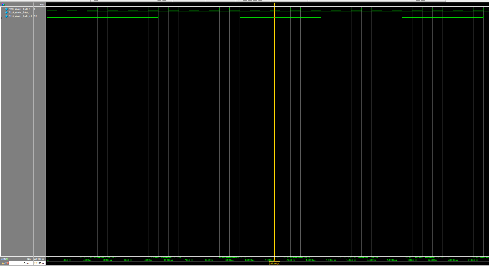
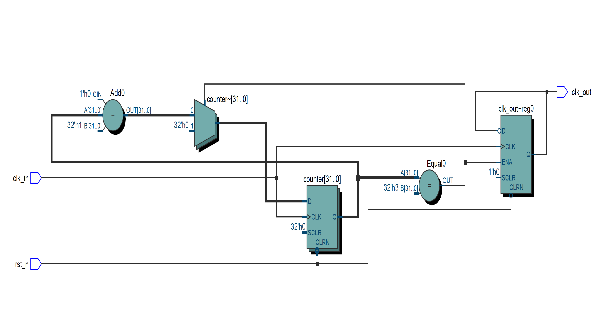

# 🕒 Verilog Clock Divider

A modular and parameterized Verilog clock divider module with testbench, simulation waveform, and RTL diagram.  
Designed for SPI clock generation, timing control, or low-frequency clock output.

---

## 📦 Features

- Parameterizable division factor via `DIV_FACTOR`
- Synchronous counter-based design
- Clean reset behavior
- Testbench included for simulation

## 🧱 File Overview

| File                     | Description                            |
|--------------------------|----------------------------------------|
| `clock_divider.v`        | Verilog RTL for the clock divider      |
| `clock_divider_tb.v`     | Testbench to simulate and verify       |
| `wave_clock_divider_tb.png` | ModelSim simulation waveform           |
| `RTL_clock_divider.png`  | RTL diagram from Quartus synthesis     |

---

## 🔍 Simulation Waveform

This waveform shows `clk_in` toggling every 10ns, and `clk_out` toggling every 40ns (i.e., `DIV_FACTOR = 4`):



---

## 🧠 RTL Structure

Schematic generated from Quartus RTL Viewer:



---

## 🛠️ Parameter Description

```verilog
parameter DIV_FACTOR = 4;
Output clock = Input clock ÷ (2 × DIV_FACTOR)

Example: If clk = 100MHz and DIV_FACTOR = 4, then clk_out = 12.5MHz

💡 Applications
a. SPI / I2C / UART clock generation
b. LED blinking (e.g., 1Hz)
c. PWM base signal
d. Generic clock enable generator


